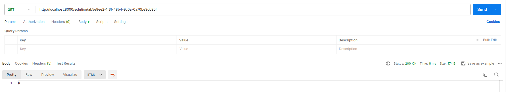

# Distributed Sudoku Solver

## Introduction
This project is a distributed sudoku solver using MapReduce. The project is implemented in Python and uses Flask for the API, celery for the distributed task queue, and RabbitMQ as the message broker, Redis as the backend for celery, and for caching the results.

## Architecture
The architecture of the project is as follows:

- **Master**: The master node is responsible for receiving the sudoku board from the client, splitting the board into smaller chunks(3x3 subpuzzles), and sending the chunks to the worker nodes. It also collects the results from the worker nodes and combines them to form 3x9 subpuzzles. And finally, it combines the 3x9 subpuzzles to create the final solved sudoku board.

- **Worker**: The worker nodes receive the 3x3 subpuzzles from the master node, generate all possible solutions for the subpuzzles, and send the solutions back to the master node. The workers are also responsible for validating the 3x9 subpuzzles received from the master node, and validating the final solved sudoku board.


## Installation
To install the project, follow the steps below:
    - Clone the repository
    - Install the dependencies using the command `pip install -r requirements.txt`
    - Start the RabbitMQ server, docker example: `docker run -d -p 5672:5672 rabbitmq`
    - Start the Redis server, docker example: `docker run -d -p 6379:6379 redis`
    - Start the celery worker using the command `celery -A task worker --loglevel=info`
    - Start the Flask server using the command `python3 server.py`

## Usage
To use the project, follow the steps below:
    - Send a POST request to the `/solve` endpoint with the sudoku board in the request body. The sudoku board should be a 9x9 matrix with empty cells represented by 0.
    - The server will return the puzzle ID.
    - Send a GET request to the `/solution/<puzzle_id>` endpoint to check the puzzle status. It will return the puzzle if it is solved, or the number of subpuzzles solved if it is still in progress.

## Example
To solve the following sudoku board:
```
{"sudoku": 
    [[3, 0, 1, 9, 6, 2, 7, 0, 0], 
    [9, 7, 6, 8, 5, 4, 3, 1, 0], 
    [5, 0, 0, 7, 3, 1, 9, 0, 8], 
    [6, 9, 0, 5, 7, 8, 1, 3, 4], 
    [8, 0, 0, 0, 4, 6, 2, 7, 9], 
    [7, 4, 3, 1, 2, 9, 8, 5, 6], 
    [4, 3, 9, 2, 1, 5, 6, 8, 7], 
    [0, 6, 0, 4, 8, 0, 5, 9, 1], 
    [1, 5, 8, 6, 9, 7, 0, 2, 3]]
}
```
server running on localhost:8000
    - Send a POST request to `http://localhost:5000/solve` with the sudoku board in the request body.
    - The server will return the puzzle ID.
    - Send a GET request to `http://localhost:5000/solution/<puzzle_id>` to check the status of the puzzle. It will return the puzzle if it is solved, or the number of subpuzzles solved if it is still in progress.
    **post**
    
    **get a puzzle that isn't solved or is still solving**
    
    **get a puzzle that is solved**
    
    **server example**
    
## Additional Information
Server/master:
    -The server can handle multiple requests at the same time and can solve various sudoku puzzles concurrently, once it's multi-threaded.
    -The server can be initialized with some parameters, such as the port number (-p), and a delay (-d) to simulate a slow workers check functions, the delay is in milliseconds.
    example: `python3 server.py -p 5000 -d 5` 
Worker:
    -The worker can be initialized with some parameters, such as the -b parameter to specify the broker URL if they are running on different machines. However, you can use the default celery worker command to start the worker.
    example using worker.py: `python3 worker.py -b 192.168.14.22:5672`

**Note**: There is a half-implemented rabbitmq cluster in the compose file. You can take a look at it if you want to run the project in a cluster environment and adapt it to your needs.
